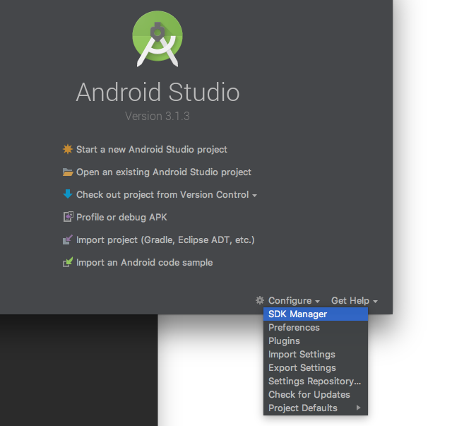
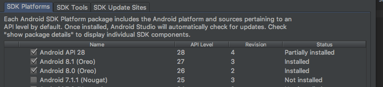

# EventLogger

The app that tracks all your "important" work activities

## Getting Started

These instructions will get you a copy of the project up and running on your local machine for development and testing purposes. See deployment for notes on how to deploy the project on a live system.

### Prerequisites

* install react native cli - `npm install -g react-native-cli`
* install yarn
* install android studio
* install xcode

You will also need the last version of the command line tools installed.


### Installing

Install application dependencies with Yarn `yarn install`; as part of the installation, a pre-commit git hook should be installed through husky.

#### Android

To execute the App on Android emulator you need to install a platform SDK and configure an Android Virtual Device from Android Studio IDE.

**SDK Manager**



**SDK Platforms**



Set the ANDROID_HOME environment variable `export ANDROID_HOME=~/Library/Android/sdk`, you can add this variable to your terminal (.bashrc, .zshrc etc..) configuration.

There are 2 ways to create an AVD:

1. by Android Studio
2. by **avdmanager** CLI

The steps to create an AVD by CLI are:

- `cd $ANDROID_HOME/tools/bin`
- `./sdkmanager "system-images;android-28;google_apis;x86"`
- `./sdkmanager --licenses` - you have to accept all licenses
- `./avdmanager create avd -n Pixel_2_API_28 -k "system-images;android-28;google_apis;x86" -d 17` - here you'll create the AVD
- to check that all worked out run this command `./avdmanager list avd`

## Running the tests

Run `yarn test` from the project root folder.

### Break down into end to end tests

Explain what these tests test and why

```
Give an example
```

### And coding style tests

Explain what these tests test and why

```
Give an example
```

## Deployment

You can run the app in development mode by executing one of the following commands:

* `react-native run-android`
* `react-native run-ios`

Follow the React-Native docs for a detailed walkthrough on producing and releasing the signed app for both Android and iOS.

## Built With

* [yarn](https://yarnpkg.com/en/) - Fast, reliable, and secure dependency management.
* [react native](https://facebook.github.io/react-native/) - Build native mobile apps using JavaScript and React
* [redux](https://redux.js.org/) - Redux is a predictable state container for JavaScript apps.
* [ESLint](https://eslint.org) - The pluggable linting utility for JavaScript and JSX

## Contributing

Please read [CONTRIBUTING.md](./CONTRIBUTING.md) for details on our code of conduct, and the process for submitting pull requests to us.

## Versioning

We use [SemVer](http://semver.org/) for versioning. For the versions available, see the [tags on this repository](https://github.com/your/project/tags).

## Authors

* **Matteo Codogno** - *Initial work* - [papasmurf17](https://github.com/papasmurf17)

See also the list of [contributors](https://github.com/papasmurf17/event-logger/contributors) who participated in this project.

## License

This project is licensed under the MIT License - see the [LICENSE.md](LICENSE.md) file for details

## Tips

To update emulator by CLI without open Android Studio you can run `sdkmanager --update`.

## Acknowledgments


